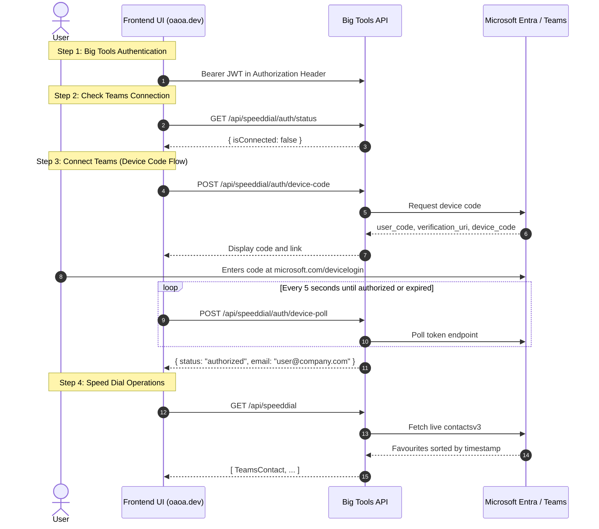

# Teams Speed Dial Manager — Frontend Implementation Guide

This document is an implementation specification for developing the frontend user interface for the **Microsoft Teams Speed Dial Manager** tool on `oaoa.dev`. It is written specifically for an AI coding agent or frontend developer to build the UI with full fidelity.

---

## 1. Architecture & Authentication Flow

The frontend operates decoupled from the backend. The API handles all Microsoft Entra ID device code exchanges, token management, silent refresh, and communication with the internal Microsoft Teams `contactsv3` REST API.



### Two-Tier Authentication Context
1. **Big Tools JWT Auth (Tier 1)**:
   - All requests require the standard Bearer token in the `Authorization` header:
     `Authorization: Bearer <big_tools_jwt>`
2. **Teams Delegated Session (Tier 2)**:
   - The user links their Microsoft Teams work/school account using the **Device Code Flow**.
   - Tokens are stored securely on the backend in Redis per user profile. The frontend never needs to store or refresh Teams tokens.

---

## 2. API Endpoints Reference

Base URL:
- Production: `https://api.oaoa.dev`
- Local development: `http://localhost:5005`

All endpoints accept and return JSON and require `Authorization: Bearer <token>`.

### Authentication Endpoints

#### 1. Check Teams Connection Status
- **Method**: `GET`
- **Route**: `/api/speeddial/auth/status`
- **Response**:
```json
{
  "isConnected": true,
  "email": "user@company.com",
  "displayName": "Jane Doe",
  "tenantId": "common",
  "clientId": "68ead5fb-...",
  "expiresAt": "2026-09-10T02:30:00Z"
}
```
If not connected:
```json
{
  "isConnected": false
}
```

#### 2. Initiate Device Code Login
- **Method**: `POST`
- **Route**: `/api/speeddial/auth/device-code`
- **Request Body** (optional overrides; can send `{}` to use server defaults):
```json
{
  "tenantId": "common",
  "clientId": ""
}
```
- **Response** (`200 OK`):
```json
{
  "user_code": "ABCD-WXYZ",
  "device_code": "DAQABAAEA...",
  "verification_uri": "https://microsoft.com/devicelogin",
  "expires_in": 900,
  "message": "To sign in, use a web browser to open the page https://microsoft.com/devicelogin and enter the code ABCD-WXYZ to authenticate."
}
```

#### 3. Poll Device Code Status
- **Method**: `POST`
- **Route**: `/api/speeddial/auth/device-poll`
- **Request Body**:
```json
{
  "deviceCode": "DAQABAAEA...",
  "tenantId": "common",
  "clientId": ""
}
```
- **Responses**:
  - In progress: `{ "status": "pending" }`
  - Success: `{ "status": "authorized", "email": "user@company.com" }`
  - Expired: `{ "status": "expired" }`
  - Error: `{ "status": "error" }`

#### 4. Disconnect Teams Session
- **Method**: `DELETE`
- **Route**: `/api/speeddial/auth/session`
- **Response** (`200 OK`):
```json
{
  "message": "Teams session disconnected."
}
```

---

### Speed Dial Operations

#### 5. Get Live Speed Dials
Fetches live speed dials in native Teams display order (sorted by favourite creation timestamp).
- **Method**: `GET`
- **Route**: `/api/speeddial`
- **Response** (`200 OK`):
```json
[
  {
    "id": "c1a2b3c4...",
    "mri": "8:orgid:11111111-2222-3333-4444-555555555555",
    "displayName": "Nathan Black",
    "email": "nathan@company.com",
    "isFavourite": true,
    "favouriteCreated": "2026-03-01T10:15:30Z"
  },
  {
    "id": "c2b3c4d5...",
    "mri": "8:orgid:22222222-3333-4444-5555-666666666666",
    "displayName": "Aleyna Brotchie",
    "email": "aleyna@company.com",
    "isFavourite": true,
    "favouriteCreated": "2026-03-01T10:16:00Z"
  }
]
```

#### 6. Reorder Speed Dials (Drag & Drop)
Applies the new order using the remove-all → sequential re-add algorithm.
- **Method**: `POST`
- **Route**: `/api/speeddial/reorder`
- **Request Body**:
```json
{
  "contactIds": [
    "c2b3c4d5...",
    "c1a2b3c4..."
  ]
}
```
- **Response** (`200 OK`):
```json
{
  "success": true,
  "message": "Speed dials reordered successfully.",
  "speedDials": [
    {
      "id": "c2b3c4d5...",
      "displayName": "Aleyna Brotchie",
      "email": "aleyna@company.com",
      "isFavourite": true,
      "favouriteCreated": "2026-09-10T01:30:00Z"
    },
    {
      "id": "c1a2b3c4...",
      "displayName": "Nathan Black",
      "email": "nathan@company.com",
      "isFavourite": true,
      "favouriteCreated": "2026-09-10T01:30:01Z"
    }
  ]
}
```

#### 7. Add Contact to Speed Dial
- **Method**: `POST`
- **Route**: `/api/speeddial`
- **Request Body** (provide `contactId` if existing contact, or `mri` + `email` + `displayName`):
```json
{
  "contactId": "c1a2b3c4...",
  "mri": "8:orgid:...",
  "displayName": "IT Helpdesk",
  "email": "helpdesk@company.com"
}
```
- **Response** (`200 OK`):
```json
{
  "success": true,
  "message": "Contact added to speed dial."
}
```

#### 8. Remove Contact from Speed Dial
- **Method**: `DELETE`
- **Route**: `/api/speeddial/{contactId}`
- **Response** (`200 OK`):
```json
{
  "success": true,
  "message": "Contact removed from speed dial."
}
```

#### 9. Search Contacts
Searches across the user's Teams address book and organizational directory.
- **Method**: `GET`
- **Route**: `/api/contacts/search?q={query}` (or `/api/speeddial/search?q={query}`)
- **Response** (`200 OK`):
```json
[
  {
    "id": "c1a2b3c4...",
    "mri": "8:orgid:11111111-2222-3333-4444-555555555555",
    "displayName": "Nathan Black",
    "email": "nathan@company.com",
    "isFavourite": false
  }
]
```

#### 10. Export Speed Dials
Exports the current speed dial list to a JSON file.
- **Method**: `GET`
- **Route**: `/api/speeddial/export`
- **Response** (`200 OK`):
```json
[
  {
    "id": "c1a2b3c4...",
    "mri": "8:orgid:...",
    "displayName": "Nathan Black",
    "email": "nathan@company.com"
  }
]
```

#### 11. Import Speed Dials
Imports an array of contacts and creates them sequentially.
- **Method**: `POST`
- **Route**: `/api/speeddial/import`
- **Request Body**:
```json
{
  "contacts": [
    {
      "id": "...",
      "mri": "8:orgid:...",
      "displayName": "Nathan Black",
      "email": "nathan@company.com"
    }
  ]
}
```
- **Response** (`200 OK`):
```json
{
  "success": true,
  "message": "Speed dials imported successfully.",
  "speedDials": [ ... ]
}
```

---

## 3. TypeScript Interfaces

```typescript
// Models
export interface TeamsContact {
  id: string;
  mri: string;
  displayName: string;
  email: string;
  isFavourite: boolean;
  favouriteCreated?: string | null;
}

export interface TeamsSessionStatus {
  isConnected: boolean;
  email?: string | null;
  displayName?: string | null;
  tenantId?: string | null;
  clientId?: string | null;
  expiresAt?: string | null;
}

export interface DeviceCodeResponse {
  user_code: string;
  device_code: string;
  verification_uri: string;
  expires_in: number;
  message: string;
}

export interface DevicePollResponse {
  status: 'pending' | 'authorized' | 'expired' | 'error';
  email?: string;
  error?: string;
}

export interface ReorderRequest {
  contactIds: string[];
}

export interface ReorderResponse {
  success: boolean;
  message: string;
  speedDials: TeamsContact[];
}

export interface AddSpeedDialRequest {
  contactId?: string;
  mri?: string;
  displayName?: string;
  email?: string;
}

export interface ImportSpeedDialsRequest {
  contacts: Array<{
    id?: string;
    mri?: string;
    displayName?: string;
    email?: string;
  }>;
}
```

---

## 4. UI Components & Screen Specifications

### Component Hierarchy
```
SpeedDialManager/
├── ConnectionBanner (shows active Teams account + Disconnect button)
├── DeviceCodeModal (shows code, link, copy button, and polling animation)
├── Toolbar/
│   ├── SearchInput (typeahead contact search to add to speed dial)
│   ├── ExportButton (downloads speed-dials.json)
│   ├── ImportButton (triggers file picker and confirms replacement)
│   └── RefreshButton (fetches fresh live list)
├── SpeedDialList/
│   └── DraggableSpeedDialItem/ (drag handle, avatar, name, email, delete button)
└── EmptyState (when no speed dials exist)
```

### UI Behavior Rules

1. **Reorder via Drag-and-Drop**:
   - Use a robust library like `@hello-pangea/dnd` or `@dnd-kit/core`.
   - **Optimistic UI**: When the user drops an item, update the local list state immediately.
   - Send `POST /api/speeddial/reorder` with the new list of IDs.
   - Show a subtle saving indicator ("Updating Teams order...").
   - If the backend returns an error, revert the list state to previous and display a toast alert.

2. **Device Code Modal Flow**:
   - When user clicks "Connect Microsoft Teams", call `POST /api/speeddial/auth/device-code`.
   - Open modal displaying:
     - `user_code` prominently in large monospace font with a **"Copy Code"** button.
     - Clickable link: **"Open Microsoft Login (`https://microsoft.com/devicelogin`)"** (target `_blank`).
     - Instructions: *"Enter the code in the opened Microsoft tab and sign in with your Teams account."*
     - Pulsing spinner indicating *"Waiting for sign in..."*.
   - Start polling `POST /api/speeddial/auth/device-poll` every **5 seconds**.
   - When `status === 'authorized'`: close modal, show success toast, reload speed dial list.
   - When `status === 'expired'`: show timeout message with a "Retry" button.

3. **Handling `401 teams_auth_required`**:
   - If any speed dial API returns `401` with `error: "teams_auth_required"`, prompt the user to re-link Teams via the Device Code flow.

4. **Contact Search & Add**:
   - Debounce search input by 300ms.
   - When results appear in the dropdown, display an **"Add to Speed Dial"** button on each row.
   - If already in speed dial (`isFavourite: true`), show a disabled badge ("Already in Favorites").

5. **Export & Import**:
   - **Export**: Trigger browser download of `teams-speed-dials-<date>.json`.
   - **Import**: Accept a `.json` file, display confirmation dialog (*"This will replace your current speed dial list with the imported contacts. Proceed?"*), and send `POST /api/speeddial/import`.

---

## 5. Reference React / TypeScript API Client

```typescript
// api/teamsSpeedDial.ts
const API_BASE = process.env.NEXT_PUBLIC_API_URL || 'https://api.oaoa.dev';

async function fetchWithAuth<T>(endpoint: string, options: RequestInit = {}): Promise<T> {
  const token = localStorage.getItem('big_tools_jwt');
  const headers = new Headers(options.headers || {});
  headers.set('Content-Type', 'application/json');
  if (token) {
    headers.set('Authorization', `Bearer ${token}`);
  }

  const response = await fetch(`${API_BASE}${endpoint}`, {
    ...options,
    headers,
  });

  if (!response.ok) {
    const errorData = await response.json().catch(() => ({}));
    throw new Error(errorData.message || errorData.error || `HTTP ${response.status}`);
  }

  return response.json();
}

export const TeamsSpeedDialApi = {
  // Auth
  getStatus: () => fetchWithAuth<TeamsSessionStatus>('/api/speeddial/auth/status'),
  initiateDeviceCode: (tenantId?: string, clientId?: string) =>
    fetchWithAuth<DeviceCodeResponse>('/api/speeddial/auth/device-code', {
      method: 'POST',
      body: JSON.stringify({ tenantId, clientId }),
    }),
  pollDeviceCode: (deviceCode: string) =>
    fetchWithAuth<DevicePollResponse>('/api/speeddial/auth/device-poll', {
      method: 'POST',
      body: JSON.stringify({ deviceCode }),
    }),
  disconnect: () =>
    fetchWithAuth<{ message: string }>('/api/speeddial/auth/session', {
      method: 'DELETE',
    }),

  // Speed Dial
  getSpeedDials: () => fetchWithAuth<TeamsContact[]>('/api/speeddial'),
  reorder: (contactIds: string[]) =>
    fetchWithAuth<ReorderResponse>('/api/speeddial/reorder', {
      method: 'POST',
      body: JSON.stringify({ contactIds }),
    }),
  add: (contact: AddSpeedDialRequest) =>
    fetchWithAuth<{ success: boolean }>('/api/speeddial', {
      method: 'POST',
      body: JSON.stringify(contact),
    }),
  remove: (contactId: string) =>
    fetchWithAuth<{ success: boolean }>(`/api/speeddial/${encodeURIComponent(contactId)}`, {
      method: 'DELETE',
    }),
  search: (query: string) =>
    fetchWithAuth<TeamsContact[]>(`/api/contacts/search?q=${encodeURIComponent(query)}`),
  export: () => fetchWithAuth<TeamsContact[]>('/api/speeddial/export'),
  import: (contacts: Array<{ id?: string; mri?: string; displayName?: string; email?: string }>) =>
    fetchWithAuth<ReorderResponse>('/api/speeddial/import', {
      method: 'POST',
      body: JSON.stringify({ contacts }),
    }),
};
```
